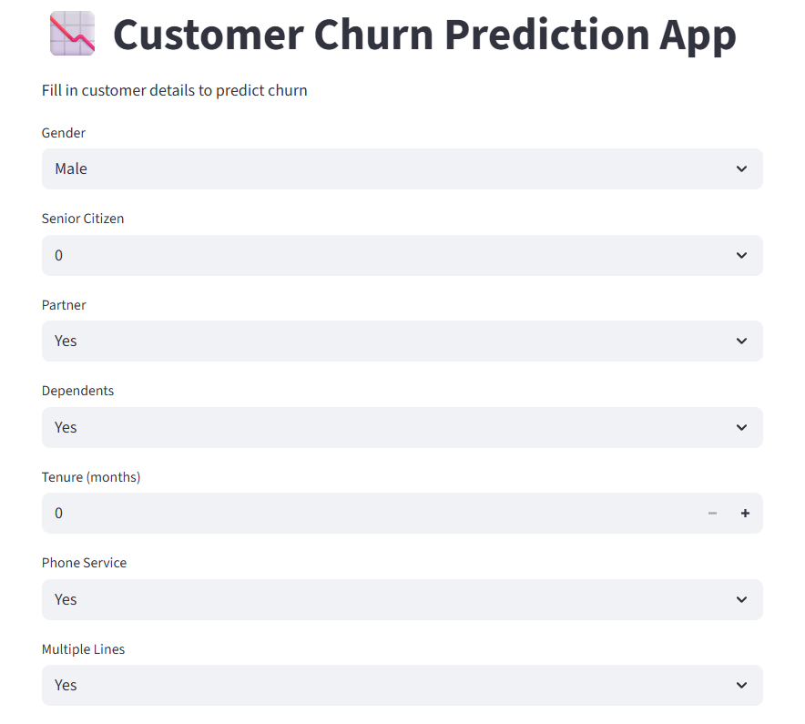
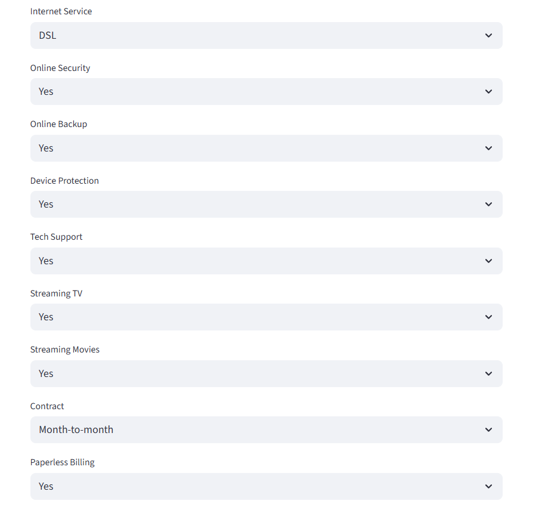
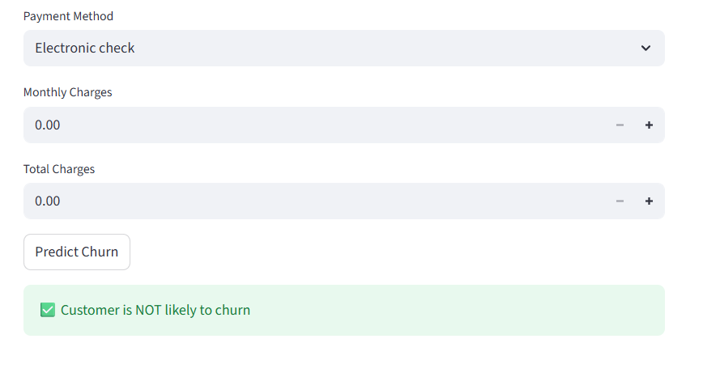

# Telco Customer Churn Prediction

Machine learning project that predicts whether a telecom customer will churn, with a Streamlit app for interactive predictions.

## Tools Used
Python, Pandas, NumPy, Scikit-learn, XGBoost, Streamlit, Git

## What I Did
- Cleaned the data and encoded categorical variables
- Explored the data (EDA) and prepared features
- Compared Decision Tree, Random Forest and XGBoost models
- Evaluated the models with a confusion matrix and accuracy, precision, recall and F1 score
- Built a Streamlit app for churn prediction

## Model Comparison (Accuracy)
| Model | Accuracy |
|---|---|
| Decision Tree | 0.78 |
| Random Forest | 0.84 |
| XGBoost | 0.83 |

**Best model:** Random Forest, which had the highest accuracy.

## Files
- `Customer_Churn_Prediction_using_ML` - notebook with analysis and models
- `app.py` - Streamlit app
- `customer_churn_model.pkl`, `encoders.pkl` - saved model and encoders
- `WA_Fn-UseC_-Telco-Customer-Churn` - dataset

## How to Run
pip install -r requirements.txt
streamlit run app.py

## App Preview

